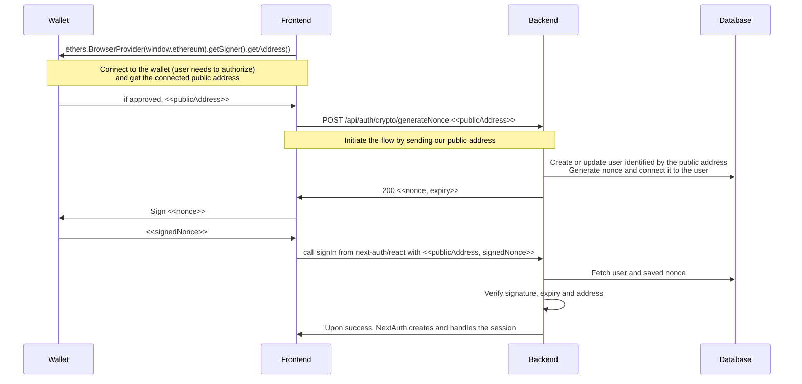

# NextJs Metamask Authentication with NextAuth

Made by [](https://www.dakai.io/).

## Purpose

This project demonstrates how to authenticate with [Metamask](https://metamask.io/) using [Next.js](https://nextjs.org) and [NextAuth.js](https://next-auth.js.org).

The same structure and idea can be used for authentication using any other crypto wallet that has a browser extension.

This example stores the generated nonce in a database with the user data. To use a database with NextAuth you need to set up an adapter. See the [docs](https://next-auth.js.org/adapters/overview) for more information about the available adapters. For this example we used [Prisma](https://www.prisma.io/) with SQLite for ease of implementation. For production environments please don't use SQLite.

## Getting Started

### Prerequisites

- [NodeJS ^18.15](https://nodejs.org/en/)
- [Yarn ^1.22](https://yarnpkg.com/)

### Quickstart

```bash
git clone https://github.com/DakaiGroup/nextjs-nextauth-metamask.git
cd nextjs-nextauth-metamask
yarn
yarn prisma migrate dev
yarn dev
```

Open [localhost:3000](http://localhost:3000) in your browser to see the result.

## How it works (build your own tutorial)

### Start project and install dependencies

To get started create a new Next.js project based on the official Next.js documentation:

```bash
yarn create next-app --typescript
```

Install the required packages:

```bash
yarn add \
  @prisma/client prisma \
  next-auth @next-auth/prisma-adapter \
  ethers
```

If you build your own you can use any ORM, not just Prisma. See the [NextAuth](https://next-auth.js.org/adapters/overview) documentation about the supported adapters. You can also build a wallet signature based authentication using ethers without NextAuth but that's outside the scope of this tutorial. See the [ethers documentation](https://docs.ethers.org/v6/getting-started/#starting-signing) for further information.

### Set up database models

For the rest of this tutorial we assume that you went with Prisma as the ORM and SQLite as the database engine. If you use any other ORM or database then change the following steps accordingly.

Create the [models required](https://next-auth.js.org/adapters/models) by NextAuth in your database schema. In this schema every user is saved to the `User` table, the other tables are not interesting for this example. `Account` is there for OIDC provider support, `Session` is used for the database based session strategy, `VerificationToken` is for magic link email authentication.

We need to extend this schema to support crypto wallet based login. We need to save the `publicAddress` of the user in the `User` table as a unique field so we can use it to identify the user with that instead of email. We also need to save a `nonce` and an `expires` field with the user either in the `User` table or preferably in it's own table. These fields are used to store the secure random nonce we will generate for signing. For ease of implementation every user can have no more than one active nonce associated with them.

See the completed schema in [prisma/schema.prisma](prisma/schema.prisma).

To update the database with the schema run:

```bash
yarn prisma migrate dev
```

### Data flow

For easier understanding of the following sections here is a data flow diagram:



### Create backend functionality

As seen on the above diagram we need to set up an endpoint for generating a nonce that gets assigned to the user's public address in the database. This endpoint also creates the user object if it doesn't already exist in the database. It receives a public address from the frontend and returns the genrated nonce with it's expiry time. The nonce will be displayed in the user's wallet for signing. It is possible to add some extra text explaining what the user is signing.

The core of the logic is as follows:

```typescript
export default async function generateNonce(
  req: NextApiRequest,
  res: NextApiResponse
) {
  const { publicAddress } = req.body;

  const nonce = crypto.randomBytes(32).toString("hex");

  // Set the expiry of the nonce to 1 hour
  const expires = new Date(new Date().getTime() + 1000 * 60 * 60);

  // Create or update the nonce for the given user
  await prisma.user.upsert({
    where: { publicAddress },
    create: {
      publicAddress,
      cryptoLoginNonce: {
        create: {
          nonce,
          expires,
        },
      },
    },
    update: {
      cryptoLoginNonce: {
        upsert: {
          create: {
            nonce,
            expires,
          },
          update: {
            nonce,
            expires,
          },
        },
      },
    },
  });

  return res.status(200).json({
    nonce,
    expires: expires.toISOString(),
  });
}
```

The full implementation of this endpoint with explanatory comments is at [pages/api/auth/crypto/generateNonce.ts](pages/api/auth/crypto/generateNonce.ts).

Other than that we need to configure NextAuth to accept our custom authentication method. We need to create [[...nextauth].ts](/pages/api/auth/[...nextauth].ts) in `/pages/api/auth`. The configuration options are available in the NextAuth [documentation](https://next-auth.js.org/configuration/options).

We need to add a custom provider, let's call it `crypto` with the following parameters:

```typescript
CredentialsProvider({
  id: "crypto",
  name: "Crypto Wallet Auth",
  credentials: {
    publicAddress: { label: "Public Address", type: "text" },
    signedNonce: { label: "Signed Nonce", type: "text" },
  },
  authorize: authorizeCrypto,
}),
```

The `authorize` parameter from the above snippet expects a custom function that receives the configured parameters (`publicAddress` and `signedNonce` here) and is expected to return a `User` object if the parameters are valid or `null` if the authentication failed.

The `authorizeCrypto` function is as follows:

```typescript
async function authorizeCrypto(
  credentials: Record<"publicAddress" | "signedNonce", string> | undefined,
  req: Pick<RequestInternal, "body" | "headers" | "method" | "query">
) {
  if (!credentials) return null;

  const { publicAddress, signedNonce } = credentials;

  // Get user from database with their generated nonce
  const user = await prisma.user.findUnique({
    where: { publicAddress },
    include: { cryptoLoginNonce: true },
  });

  if (!user?.cryptoLoginNonce) return null;

  // Compute the signer address from the saved nonce and the received signature
  const signerAddress = ethers.verifyMessage(
    user.cryptoLoginNonce.nonce,
    signedNonce
  );

  // Check that the signer address matches the public address that is trying to sign in
  if (signerAddress !== publicAddress) return null;

  // Check that the nonce is not expired
  if (user.cryptoLoginNonce.expires < new Date()) return null;

  // Everything is fine, clear the nonce and return the user
  await prisma.cryptoLoginNonce.delete({ where: { userId: user.id } });

  return {
    id: user.id,
    publicAddress: user.publicAddress,
  };
}
```

The full implementation can be found under [pages/api/auth/[...nextauth].ts](pages/api/auth/[...nextauth].ts).

### Create frontend components

First we replace the contents of [pages/index.tsx](pages/index.tsx) with the following:

```typescript
import { signOut, useSession } from "next-auth/react";
import { useRouter } from "next/router";

export default function Home() {
  const router = useRouter();
  const { status } = useSession({
    required: true,
    onUnauthenticated() {
      router.push("/auth");
    },
  });

  if (status !== "authenticated") return null;

  return (
    <main>
      <p>Secure stuff that requires login.</p>
      <button onClick={() => signOut()}>Log out</button>
    </main>
  );
}
```

Here we use `NextAuth` to check whether the user has a valid session. If they don't we redirect them to `/auth`. If they are authenticated then we display the content available to logged in users. There is a button for logging out.

Then [pages/auth.tsx](pages/auth.tsx) is created as follows:

```typescript
import { ethers } from "ethers";
import { signIn } from "next-auth/react";

// Fix typescript errors for window.ethereum
declare global {
  interface Window {
    ethereum?: any;
  }
}

export default function Auth() {
  return (
    <main>
      <p>
        After clicking the button you will be prompted to connect your wallet
        with this site, then you will need to sign a nonce (random hex string)
        to prove you own the account.
      </p>
      <button onClick={onSignInWithCrypto}>Sign in with Metamask</button>
    </main>
  );
}

// This function requests a nonce then signs it, proving that
//  the user owns the public address they are using
async function onSignInWithCrypto() {
  try {
    if (!window.ethereum) {
      window.alert("Please install MetaMask first.");
      return;
    }

    // Get the wallet provider, the signer and address
    const provider = new ethers.BrowserProvider(window.ethereum);
    const signer = await provider.getSigner();
    const publicAddress = await signer.getAddress();

    // Send the public address to generate a nonce associates with our account
    const response = await fetch("/api/auth/crypto/generateNonce", {
      method: "POST",
      headers: {
        "Content-Type": "application/json",
      },
      body: JSON.stringify({
        publicAddress,
      }),
    });
    const responseData = await response.json();

    // Sign the received nonce
    const signedNonce = await signer.signMessage(responseData.nonce);

    // Use NextAuth to sign in with our address and the nonce
    await signIn("crypto", {
      publicAddress,
      signedNonce,
      callbackUrl: "/",
    });
  } catch {
    window.alert("Error with signing, please try again.");
  }
}
```

Here we have a button that initiates the sign-in flow. Upon clicking the button `onSignInWithCrypto` is called that is responsible for handling the flow described in the [Data Flow](#data-flow) section. It first connects to the user's wallet, then sends a request to `generateNonce` with the public address of the connected account. `generateNonce` replies with the generated nonce that is then signed with the wallet and sent back through `NextAuth`'s `signIn` function.

### Summary

Combining all of the above you can create a flow for authenticating users with any crypto wallet they may have. The important piece is having the user sign a message, preferably a random generated nonce with their wallet. This action proves that they own the address they want to register or sign-in as.

This method enables authenticating your users in a secure way without requiring any identifiable information or passwords from your users.

## Notes

- The example project has no error handling. If used in production you should be planning for errors and edge cases.
- This has nothing to do with [Sign-in with Ethereum](https://login.xyz/), this implementation uses [ethers](https://docs.ethers.org/v5/) to sign a nonce with the user's wallet to prove their ownership of the public address that identifies them.
- As this is just a barebones example feel free to raise any security issues here on Github.
